## Results

### Naive

Consider only fair nodes and add number of good nodes multiplied by it's goodness, divide by total nodes in the clusters.

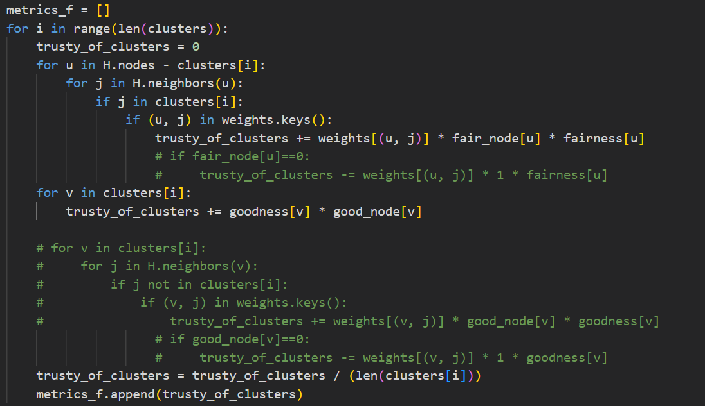

#### Positive
Before:
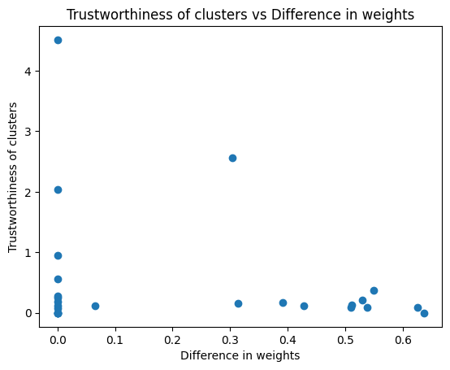

After:
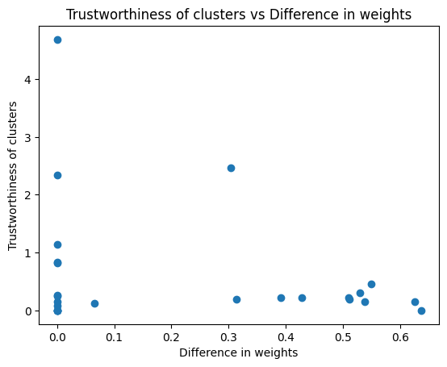
Correlation:
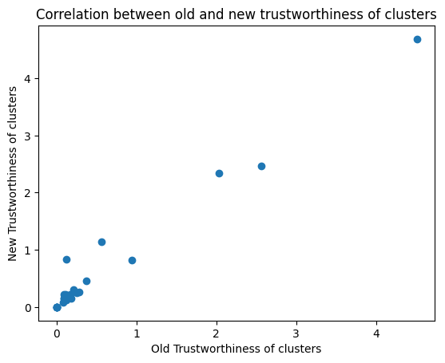

#### Negative
Before:
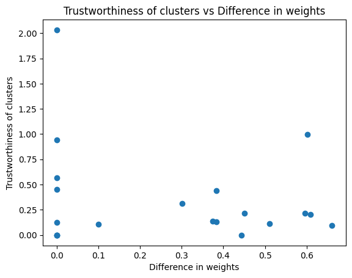

After:
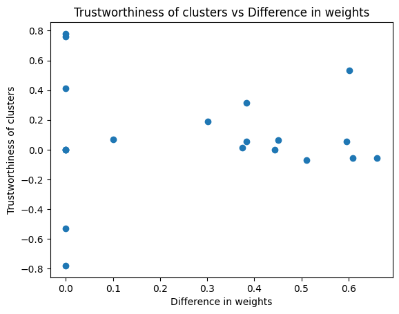
Correlation:
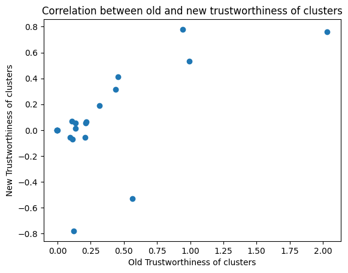

#### Random
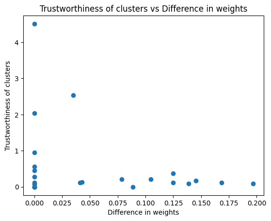

After:
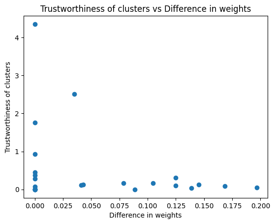
Correlation:
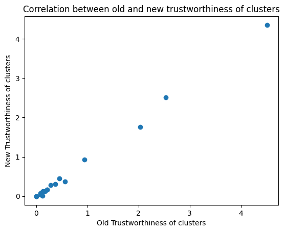

### Only fair and good

Consider only fair and good nodes while computing the metric, divide by total nodes in the clusters

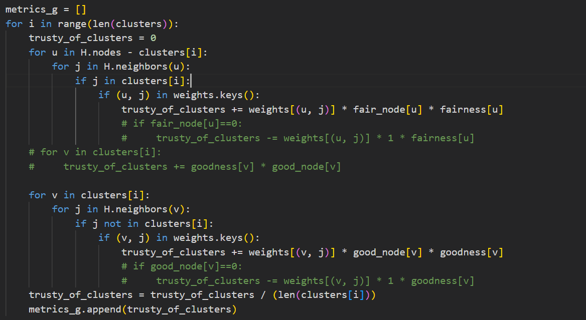

#### Positive
Before:
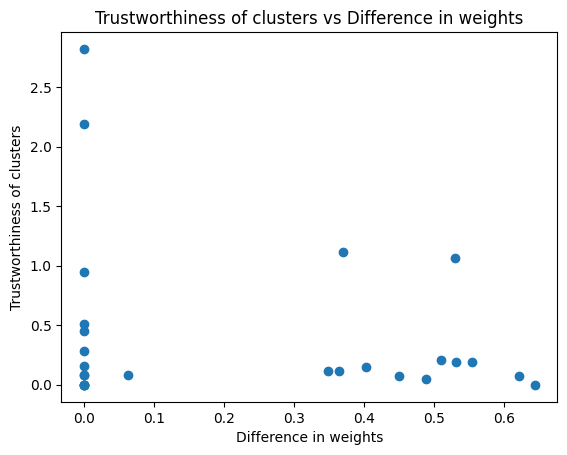

After:
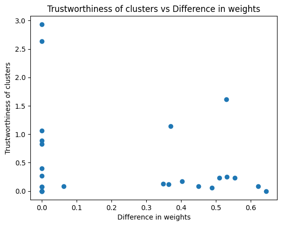
Correlation:
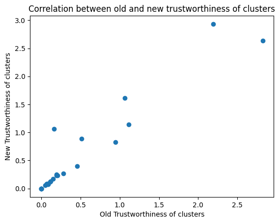

#### Negative
Before:
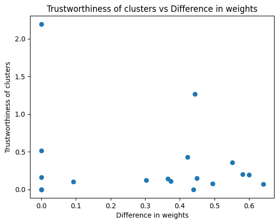

After:
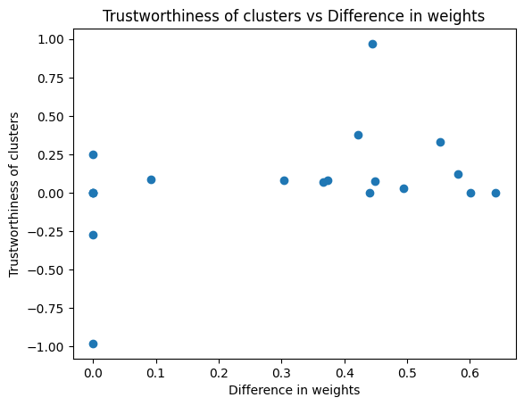
Correlation:
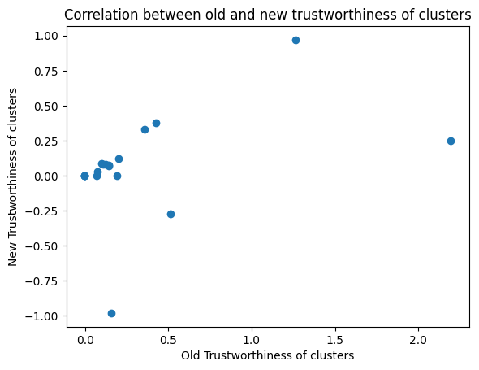

#### Random
Before:
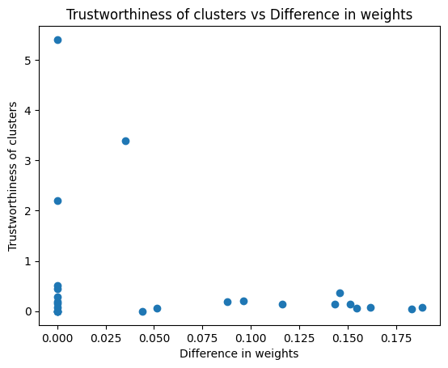

After:
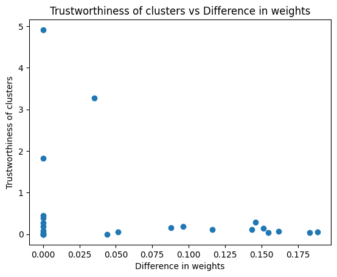
Correlation:
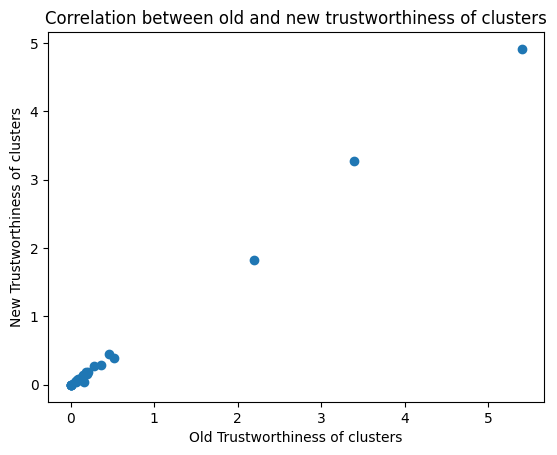

### all params
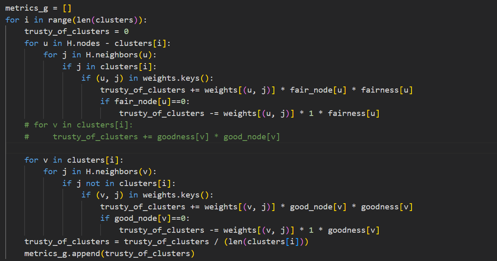

#### Positive
Before:
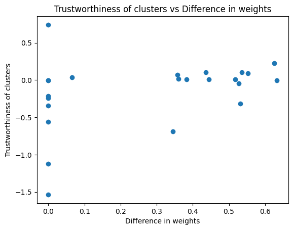

After:
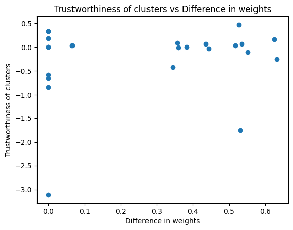
Correlation:
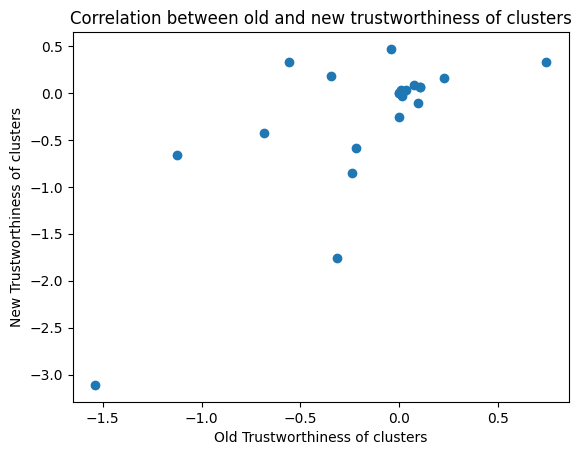

#### Negative

Before:
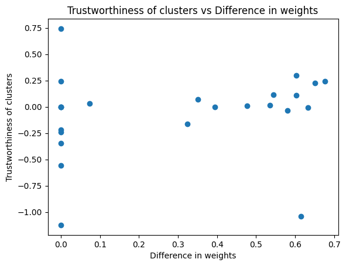

After:
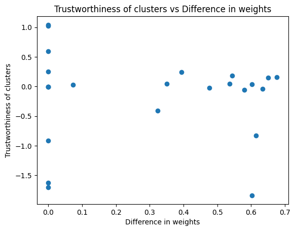
Correlation:
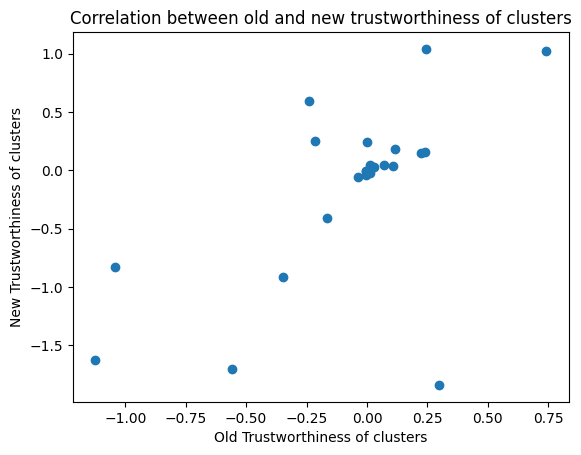

#### Random

Before:
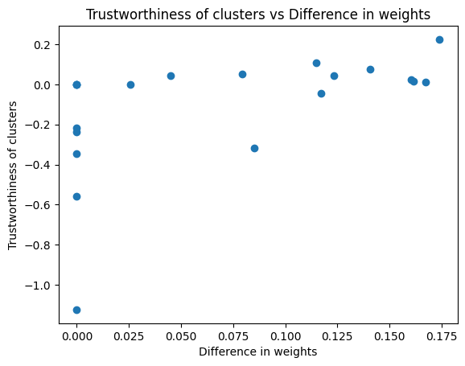

After:
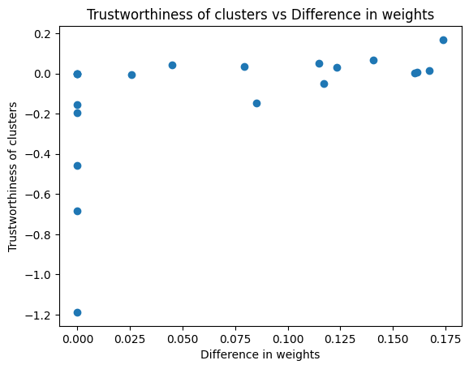
Correlation:
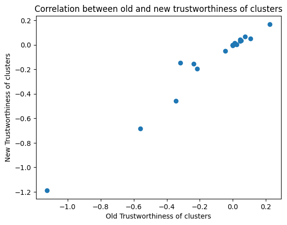